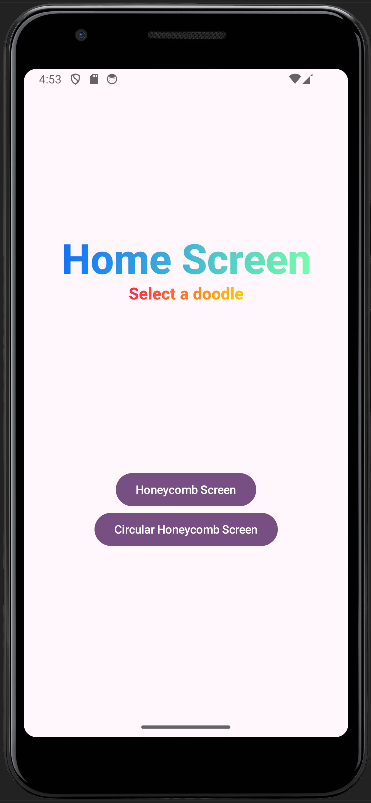

## 🎨 Jetpack Compose Doodles
- Here lies my experimentations with Jetpack Compose 👽

## Media
<table style="width:100%">
  <tr>
    <th>LazyColumn Honeycomb UI</th>
    <th>Circular Honeycomb UI</th>
    <th>Circular Composition 2</th>
  </tr>
  <tr>
    <td><video src="media/honeycomb.mp4" alt="honeycomb screen"/></td>
    <td><video src="media/circular_honeycomb.mp4"  alt="circular honeycomb screen"/></td>
    <td><video src="media/circular_honeycomb_2.mp4"  alt="circular honeycomb 2"/></td>
  </tr>
</table>

<table style="width:100%">
  <tr>
    <th>Circular Composition 3</th>
    <th>Home Screen</th>
    <th>Placeholder</th>
  </tr>
  <tr>
    <td><video src="media/circular_honeycomb_3.mp4"  alt="circular honeycomb 3"/></td>
    <td></td>
    <td></td>
  </tr>
</table>

